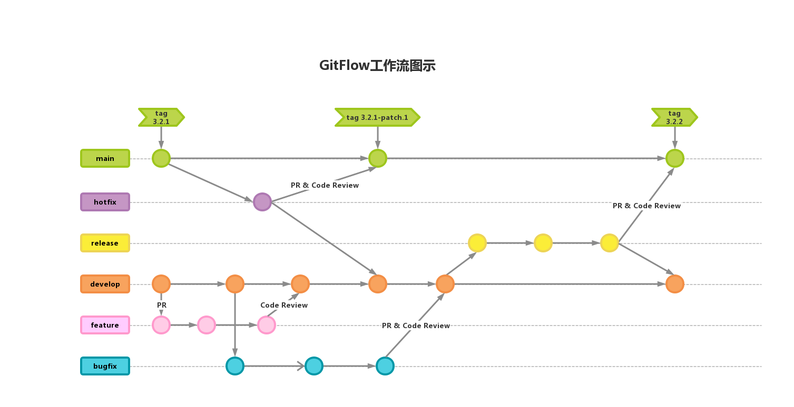

# Git Flow 规范



[git教程](https://www.atlassian.com/git/tutorials/what-is-version-control)

## 1. 分支管理

- **主分支**
  - `main`：生产环境使用的稳定版本
  - `develop`：日常开发的主分支
- **支持分支**
  - `feature/*`：功能开发分支
    - 示例：`feature/user-auth` 用户认证功能开发
    - 示例：`feature/payment-integration` 支付集成功能开发
  - `bugfix/*`：问题修复分支
    - 示例：`bugfix/login-error` 修复登录错误
    - 示例：`bugfix/404-page` 修复404页面显示问题
  - `release/*`：版本发布分支
    - 示例：`release/v1.2.0` 1.2.0版本发布
  - `hotfix/*`：紧急修复分支
    - 示例：`hotfix/critical-security` 紧急修复安全漏洞

## 2. 工作流程示例

**功能开发流程：**

1. 从 `develop` 创建功能分支
   ```bash
   git checkout -b feature/user-profile develop
   ```
2. 开发完成后提交
   ```bash
   git commit -m "feat(user): add profile page"
   ```
3. 推送到远程仓库
   ```bash
   git push origin feature/user-profile
   ```
4. 创建 Pull Request 到 `develop` 分支
5. 代码审查通过后合并

**版本发布流程：**

1. 从 `develop` 创建发布分支
   ```bash
   git checkout -b release/v1.2.0 develop
   ```
2. 进行最终测试和修复
3. 合并到 `main` 并打 tag
   ```bash
   git checkout main
   git merge --no-ff release/v1.2.0
   git tag -a v1.2.0 -m "Release version 1.2.0"
   ```
4. 同步到 `develop`
   ```bash
   git checkout develop
   git merge --no-ff release/v1.2.0
   ```
5. 删除发布分支
   ```bash
   git branch -d release/v1.2.0
   ```

**紧急修复流程：**

1. 从 `main` 创建热修复分支
   ```bash
   git checkout -b hotfix/login-error main
   ```
2. 修复问题并提交
   ```bash
   git commit -m "fix(login): handle null pointer exception"
   ```
3. 合并到 `main` 并打 tag
   ```bash
   git checkout main
   git merge --no-ff hotfix/login-error
   git tag -a v1.2.1 -m "Hotfix for login error"
   ```
4. 同步到 `develop`
   ```bash
   git checkout develop
   git merge --no-ff hotfix/login-error
   ```
5. 删除热修复分支
   ```bash
   git branch -d hotfix/login-error
   ```

## 3. 版本管理示例

- **主版本更新**：`v2.0.0` （重大架构调整，不兼容旧版本）
- **功能更新**：`v1.3.0` （新增用户权限管理功能）
- **问题修复**：`v1.2.1` （修复登录页面样式问题）
- **预发布版本**：`v1.3.0-rc.1` （1.3.0版本的第一个候选版本）
- **测试版本**：`v1.3.0-beta.2` （1.3.0版本的第二个测试版本）

## 4. 最佳实践

- 保持提交历史清晰
  - 使用 `git rebase` 整理提交记录
  - 避免直接提交到 `main` 和 `develop` 分支
- 及时清理已合并的分支
- 使用 `--no-ff` 选项合并，保留分支历史
- 每次发布都打 tag，方便回滚

## 参考链接

- [A successful Git branching model](https://nvie.com/posts/a-successful-git-branching-model/)
- [Understanding GitHub Flow and Git Flow](https://medium.com/@yanminthwin/understanding-github-flow-and-git-flow-957bc6e12220)
