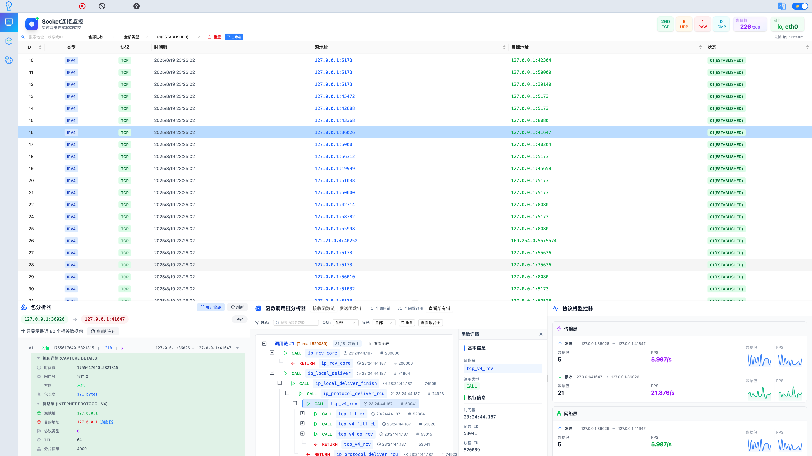
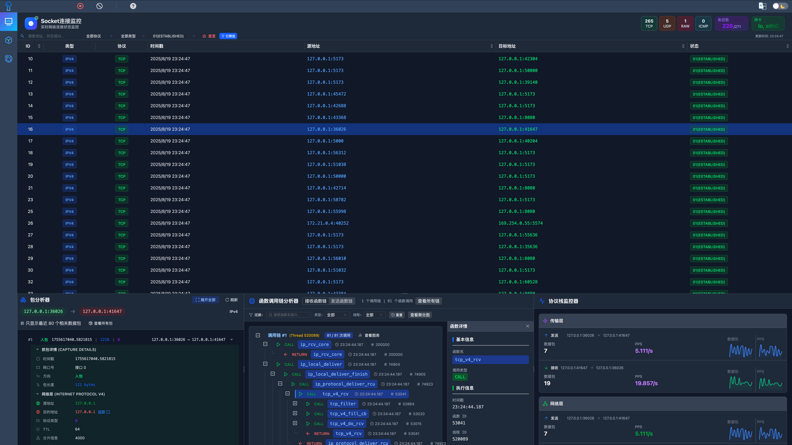

<div align="center">
  

</div>
<p align="center"><a href="./README.md">English</a> · 中文</p>

<div align="center">
  
  
</div>

# PacketScope：服务器端侧防御的“智能铠甲”

[](http://82.156.141.213:4173/)
**PacketScope** 是一款基于 eBPF 的协议栈通用分析调试工具，集性能优化、异常诊断与安全防御于一体。它致力于在服务器端实现对网络分组（Packet）在协议栈中的细粒度追踪与智能分析，解决开放服务器面临的性能瓶颈难诊断、传输路径不明晰、底层攻击难防御等三大痛点，提供可视化、智能化的端侧安全分析与防护能力。




## 背景

随着社交平台、网银服务、大模型应用、物流出行等互联网服务日益普及，开放服务器作为关键的资源执行环境，必须在可被任何人访问的前提下，兼顾性能和安全。传统 WAF、IDS 等手段在协议栈层面的防护存在盲区，PacketScope 正是为此而生：

> **🚨 三大核心痛点**：
>
> 1. 分组穿越协议栈路径不透明，瓶颈及故障点难定位
> 2. 分组跨域传输路径缺乏细粒度数据，路由风险不可见
> 3. 协议栈底层攻击隐蔽难测，传统防御工具能力有限

通过协议追踪、路径可视化、智能分析，PacketScope 为服务器构建“智能铠甲”。

## 🚀 核心能力

- 🧠 **智能驱动**：结合 eBPF 与大语言模型，提供底层网络行为观测与智能化安全防护
- 📊 **多维度分析**：实时追踪网络路径，统计延迟、丢包率、交互频率等指标
- 🌐 **全球网络可视化**：测绘全球路径及延迟，并可视化展示在拓扑图中
- 🔐 **协议栈级防护**：识别并拦截协议栈层的异常流量，弥补传统 WAF/IDS 空白
- 🖥️ **图形化界面**：用户友好的操作界面，便于安全工程师和运维人员快速上手


## ⚡ 快速开始

### 前置要求

开始之前，请确保您的系统已安装并运行 Docker：

- **Docker**：版本 20.10 或更高
- **Docker Compose**：版本 2.0 或更高

验证 Docker 安装：

```bash
docker --version
docker compose version
```

如果尚未安装 Docker，请访问 [Docker 官方网站](https://docs.docker.com/get-docker/) 获取安装说明。

### 一键部署

PacketScope 提供了便捷的部署脚本，可使用 Docker Compose 自动构建并启动所有服务。

#### 1. 克隆仓库

```bash
git clone https://github.com/Internet-Architecture-and-Security/PacketScope.git
cd PacketScope
```

#### 2. 运行部署脚本

使用 root 权限执行启动脚本：

```bash
sudo bash starter.sh
```

该脚本将自动完成以下操作：
- 检查 Docker 环境
- 停止现有服务
- 按正确顺序构建所有服务容器
- 启动所有服务
- 显示服务状态和访问信息

#### 3. 访问应用

部署完成后，打开浏览器访问：

```
http://localhost:4173/
```

### 服务端点

部署成功后，以下服务将可用：

- **Web UI**：`http://localhost:4173`
- **Guarder API**：`http://localhost:8080`
- **Tracer API**：`http://localhost:8000`
- **Analyzer-Monitor API**：`http://localhost:8010`
- **Analyzer-Calculator API**：`http://localhost:8020`

### 管理服务

**查看服务状态：**
```bash
sudo docker compose ps
```

**查看服务日志：**
```bash
sudo docker compose logs -f
```

**查看特定服务的日志：**
```bash
sudo docker compose logs -f <服务名称>
```

**停止所有服务：**
```bash
sudo docker compose down
```

**重启服务：**
```bash
sudo docker compose restart
```

**重启特定服务：**
```bash
sudo docker compose restart <服务名称>
```

> 💡 **提示**：starter.sh 脚本会自动处理整个部署过程。如需手动部署或高级配置，请参考 `modules/` 目录中各个模块的 README 文件。


## 📁 项目结构

```
.
├── CODE_OF_CONDUCT.md          # 行为准则
├── CONTRIBUTING.md             # 贡献指南
├── docker-compose.yml          # Docker Compose 配置文件
├── Dockerfile                  # 前端应用 Docker 构建文件
├── eslint.config.js            # ESLint 配置
├── index.html                  # 应用入口 HTML
├── LICENSE                     # 项目许可证
├── modules/                    # 后端服务模块
│   ├── Analyzer/              # 分析器模块
│   │   ├── Monitor/           # 流量监控子模块
│   │   ├── Calculator/     # 协议分析子模块
│   │   └── README.md          # 分析器文档
│   ├── Guarder/               # 安全防护模块
│   └── Tracer/                # 网络追踪模块
├── package.json                # Node.js 依赖配置
├── package-lock.json           # npm 锁定文件
├── pnpm-lock.yaml             # pnpm 锁定文件
├── src/                        # 前端源代码
├── public/                     # 静态资源文件
├── README.md                   # 英文文档
├── README-zh_CN.md            # 中文文档
├── SECURITY.md                # 安全策略
├── starter.sh                 # 一键部署脚本
├── tailwind.config.js         # Tailwind CSS 配置
├── TODOList.md                # 待办事项列表
├── tsconfig.app.json          # TypeScript 应用配置
├── tsconfig.json              # TypeScript 基础配置
├── tsconfig.node.json         # TypeScript Node 配置
├── vite.config.ts             # Vite 构建配置
└── vite-README.md             # Vite 使用说明
```

### 核心目录说明

- **modules/**：包含所有后端服务模块，每个模块都是独立的微服务
  - **Analyzer/**：协议栈分析和流量监控服务
  - **Guarder/**：安全防护和威胁检测服务
  - **Tracer/**：网络路径追踪和拓扑分析服务
  
- **src/**：前端应用源代码，基于 React 和 TypeScript 开发

- **public/**：静态资源文件，如图片、图标等

- **starter.sh**：一键部署脚本，自动化构建和启动所有服务

## ✨ 功能模块

PacketScope 由四个主要模块组成，每个模块都有特定用途：

```
modules
├── Analyzer  # 基于 Python 的协议栈分析、流量监控和细粒度追踪模块
├── Guarder   # 基于 Go 的安全策略模块
└── Tracer    # 基于 Python 的网络路径映射模块
```

- **Analyzer（分析器）**

  Analyzer 模块提供协议栈中分组数据流动的多维度信息统计。它可以统计数据流量、延迟、跨层交互频率、丢包率等关键指标，帮助用户全面了解网络性能和瓶颈。用于追踪连接/分组在协议栈中的交互，生成详细的可视化路径图。用户可以通过点击路径图查看不同层级的调用细节，帮助理解协议栈中数据流的详细路径和交互过程。

- **Tracer（定位器）**

  Locator 模块用于测绘从主机到全球任一 IP 地址的路径及延迟，并在全球拓扑上展示这些信息。用户可以实时查看不同地理位置间的网络延迟及路由路径，为网络优化提供数据支持。

- **Guarder（防护器）**

  Guarder 模块负责异常分组的过滤与管控。用户可以自定义规则以检测和控制异常流量，并且该模块还结合大语言模型（LLM）提供上下文信息，帮助用户更好地理解和应对潜在的网络安全威胁。

## 🧰 使用场景

- **网络协议栈性能优化**：帮助网络管理员和开发者分析网络协议栈中的流量瓶颈，优化性能。
- **网络安全威胁检测**：监控并过滤异常流量，检测潜在的攻击模式（如 DDoS、ARP 欺骗等），增强网络安全性。
- **网络故障诊断**：诊断因网络延迟、丢包或跨层交互异常引起的问题，快速定位故障源。
- **网络拓扑分析**：在跨地域或跨国网络环境中，分析网络拓扑结构、路径延迟和路由性能，为全球部署提供支持。
- **工业互联网安全**：在工业互联网环境中，对工业控制系统的协议栈进行实时监控和安全审计，保障设备和数据的安全性。

## ❤️ 贡献

欢迎提交问题和合并请求！如果你发现任何问题或有改进建议，请在 issues 中提出，或直接提交 pull request。具体贡献指南请参考[CONTRIBUTING](./CONTRIBUTING.md)

## 许可

该项目遵循 MIT 许可证，详情请见 [LICENSE](./LICENSE)。
