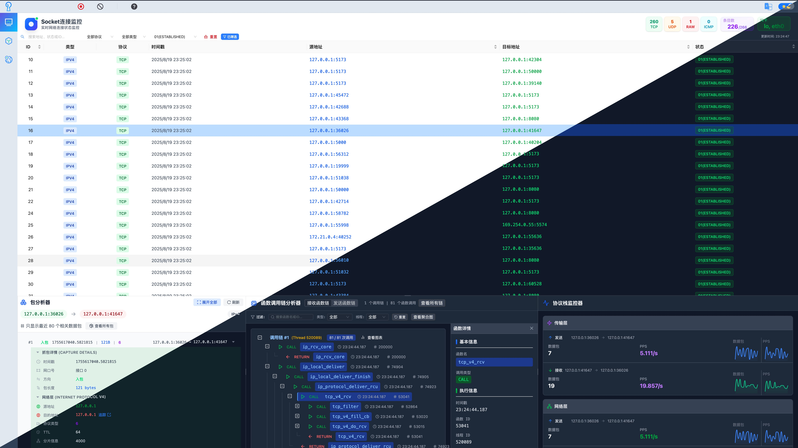

<div align="center">
  

</div>
<p align="center"><a href="./README.md">English</a> · 中文</p>

<div align="center">
  
  
</div>

# PacketScope：服务器端侧防御的"智能铠甲"

[](http://82.156.141.213:4173/)

> **本次更新：** Analyzer 模块已使用 Go + cilium/ebpf 完全重写，取代原有 Python + BCC 实现。轻量化改造移除 BCC 运行时依赖，采用 CO-RE（bpf2go）预编译 eBPF，并为各模块新增 MCP 技能集成，支持 LLM 智能体直接调用。

**PacketScope** 是一款基于 eBPF 的协议栈通用分析调试工具，集性能优化、异常诊断与安全防御于一体。它致力于在服务器端实现对网络分组（Packet）在协议栈中的细粒度追踪与智能分析，解决开放服务器面临的性能瓶颈难诊断、传输路径不明晰、底层攻击难防御等三大痛点，提供可视化、智能化的端侧安全分析与防护能力。



## 背景

随着社交平台、网银服务、大模型应用、物流出行等互联网服务日益普及，开放服务器作为关键的资源执行环境，必须在可被任何人访问的前提下，兼顾性能和安全。传统 WAF、IDS 等手段在协议栈层面的防护存在盲区，PacketScope 正是为此而生：

> **🚨 三大核心痛点**：
>
> 1. 分组穿越协议栈路径不透明，瓶颈及故障点难定位
> 2. 分组跨域传输路径缺乏细粒度数据，路由风险不可见
> 3. 协议栈底层攻击隐蔽难测，传统防御工具能力有限

通过协议追踪、路径可视化、智能分析，PacketScope 为服务器构建"智能铠甲"。

## 🚀 核心能力

- 🧠 **智能驱动**：结合 eBPF 与大语言模型，提供底层网络行为观测与智能化安全防护
- 📊 **多维度分析**：实时追踪网络路径，统计延迟、丢包率、交互频率等指标
- 🌐 **全球网络可视化**：测绘全球路径及延迟，并可视化展示在拓扑图中
- 🔐 **协议栈级防护**：识别并拦截协议栈层的异常流量，弥补传统 WAF/IDS 空白
- 🤖 **MCP 技能集成**：各模块提供 MCP 服务器，支持 LLM 智能体（Trae、Cline 等）直接调用
- 🖥️ **图形化界面**：用户友好的操作界面，便于安全工程师和运维人员快速上手

## ⚡ 快速开始

### 前置要求

- **Docker**：版本 20.10 或更高
- **Docker Compose**：版本 2.0 或更高

```bash
docker --version
docker compose version
```

### 一键部署

**国际用户：**
```bash
git clone https://github.com/Internet-Architecture-and-Security/PacketScope.git
cd PacketScope
sudo bash starter.sh
```

**国内 VPS（已配置镜像加速）：**
```bash
git clone https://github.com/Internet-Architecture-and-Security/PacketScope.git
cd PacketScope
bash install-cn.sh
```

脚本将自动安装 Docker（如未安装）、配置镜像加速、构建所有容器并启动服务。**只需在防火墙/安全组放行端口 80**。

### 访问应用

打开浏览器访问：`http://localhost`

所有服务通过 nginx 反向代理统一在 **80 端口**——无需开放多个端口。

### 服务端点

后端 API 通过 nginx 以路径前缀代理：

| 路径前缀 | 后端 | 说明 |
|---------|------|------|
| `/` | nginx（前端） | React SPA 控制台 |
| `/api/guarder/` | Guarder | 安全防护 API |
| `/api/tracer/` | Tracer | 路由追踪 API |
| `/api/monitor/` | Analyzer-Monitor | 数据包捕获与函数调用 API |
| `/api/analyzer/` | Analyzer-Calculator | 跨层指标（REST + WebSocket） |

### 管理服务

```bash
sudo docker compose -f docker-compose.yml ps              # 查看状态
sudo docker compose -f docker-compose.yml logs -f         # 查看日志
sudo docker compose -f docker-compose.yml down            # 停止所有
sudo docker compose -f docker-compose.yml restart <name>  # 重启指定服务
```

## 📁 项目结构

```
PacketScope/
├── modules/                    # 后端服务模块
│   ├── Analyzer/              # 协议栈分析（Go）
│   │   ├── Monitor/           # 数据包捕获与函数调用监控（Go + eBPF）
│   │   ├── Calculator/        # 跨层指标计算器（Go + eBPF）
│   │   ├── README.md          # 英文文档
│   │   └── README-zh.md       # 中文文档
│   ├── Guarder/               # 安全防护（Go + eBPF/XDP）
│   └── Tracer/                # 路由追踪与风险分析（Python + MCP）
├── nginx/                      # Nginx 反向代理配置
├── skills/                     # MCP 技能包，供 LLM 智能体调用
│   ├── monitor/               # Monitor MCP 服务器与客户端
│   ├── tracer/                # Tracer MCP 服务器与客户端
│   └── guarder/               # Guarder MCP 客户端
├── src/                        # 前端源码（React + TypeScript）
├── docker-compose.yml          # Docker Compose 配置（6 个服务）
├── Dockerfile                  # 多阶段构建：node 编译 → nginx 托管
├── starter.sh                  # 一键部署脚本
├── install-cn.sh               # 国内部署脚本（含镜像加速）
├── README.md                   # 英文文档
└── README-zh_CN.md             # 中文文档
```

## ✨ 功能模块

### Analyzer — 协议栈分析

Analyzer 模块已使用 Go + cilium/ebpf 完全重写，取代了原有的 Python + BCC 实现。轻量化改造移除了 BCC 运行时依赖，采用 CO-RE（bpf2go）预编译 eBPF，大幅提升部署可移植性。

**Monitor** 捕获数据包并追踪内核函数调用：

| 组件 | 技术 | 端口 | 说明 |
|------|------|------|------|
| kbatch | eBPF fentry/kprobe | - | 内核功能调用监控 |
| tcxprober | eBPF TC | - | 网络数据包捕获（ingress/egress） |
| server | Go HTTP | 8010 | RESTful API 查询服务 |

**Calculator** 计算实时跨层指标：

| 指标 | 说明 |
|------|------|
| PPS | 各层流量速率（链路层、网络层、传输层） |
| LAT | 跨层延迟（链路↔网络、网络↔传输、链路↔传输） |
| DROP | TCP 丢包率 |

通过 WebSocket（端口 8020）通信，每秒自动推送指标数据。

> 详见 [Analyzer/README-zh.md](modules/Analyzer/README-zh.md)

### Tracer — 路由追踪与风险分析

测绘从主机到全球任一 IP 的路径，提供地理/ASN 信息丰富、异常检测与基于 Spamhaus 的风险评分。

| 功能 | 说明 |
|------|------|
| traceroute | 支持 ICMP/TCP 实时追踪，逐跳流式输出 |
| GeoIP | 基于 MaxMind GeoLite2 的城市与 ASN 信息 |
| 异常检测 | 历史路径对比、路径偏移告警 |
| 风险评分 | 基于 Spamhaus DROP/EDROP 的恶意 IP 检测 |

HTTP API 端口 8000，提供 MCP 服务器供 LLM 智能体集成。

> 详见 [Tracer/README.md](modules/Tracer/README.md)

### Guarder — 安全防护

基于 eBPF/XDP 的网络安全模块，提供 AI 驱动的过滤器生成。

| 功能 | 说明 |
|------|------|
| 连接追踪 | 通过 eBPF/XDP 监控 TCP/UDP/ICMP |
| 数据包过滤 | 内核空间规则（IP、端口、协议、TCP 标志、ICMP 类型） |
| AI 过滤生成 | LLM 驱动的流量分析与自动规则生成 |
| PCAP 分析 | 上传 PCAP 文件进行 AI 驱动的安全检测 |

HTTP API 端口 8080，支持 OpenAI 兼容与 Anthropic 兼容端点。

> 详见 [Guarder/README-zh.md](modules/Guarder/README-zh.md)

## 🤖 MCP 技能

各后端模块提供 MCP（Model Context Protocol）服务器，使 LLM 智能体可以直接调用模块能力：

| 技能 | MCP 工具 | 传输方式 |
|------|---------|---------|
| **monitor** | `get_recent_packets`、`query_packets`、`get_recent_map`、`get_func_table`、`query_func_send`、`query_func_recv`、`get_socket_list`、`health_check` | SSE / stdio |
| **tracer** | `trace_target`、`analyze_target`、`get_history`、`compare_routes`、`health_check`、`server_capabilities` | SSE / stdio |
| **guarder** | `get_connections`、`get_stats`、`create_filter`、`ai_analyze`、`ai_generate`、`list_filters` | HTTP 客户端 |

### MCP 快速接入

```json
{
  "mcpServers": {
    "packetscope-monitor": {
      "transport": "sse",
      "url": "http://localhost:8012/sse"
    },
    "packetscope-tracer": {
      "transport": "sse",
      "url": "http://localhost:8013/sse"
    }
  }
}
```

> 详见 [skills/](skills/) 目录下各技能的配置与使用说明。

## 🏗️ 技术栈

| 模块 | 语言 | eBPF 加载 | 通信方式 | 数据存储 |
|------|------|----------|---------|---------|
| nginx | — | — | HTTP（80，统一入口） | — |
| Analyzer-Monitor | Go | cilium/ebpf (bpf2go, CO-RE) | HTTP REST（8010，内部） | PostgreSQL |
| Analyzer-Calculator | Go | cilium/ebpf (bpf2go, CO-RE) | WebSocket（8020，内部） | BPF map 聚合 |
| Guarder | Go | cilium/ebpf + XDP | HTTP REST（8080，内部） | 内核 map |
| Tracer | Python | nexttrace（外部） | HTTP REST（8000，内部） | 文件缓存 |
| PostgreSQL | — | — | 5432（内部） | 持久化卷 |

**部署亮点：**
- **单端口**：nginx 反向代理统一在 80 端口，API 通过路径前缀路由
- **多阶段构建**：运行时采用 alpine 镜像（~7 MB），总镜像约 1 GB（此前约 13 GB）
- **独立 PostgreSQL**：专用 `postgres:16-alpine` 容器，不再内嵌于 Monitor 中

## 🧰 使用场景

- **网络协议栈性能优化**：帮助网络管理员和开发者分析网络协议栈中的流量瓶颈，优化性能
- **网络安全威胁检测**：监控并过滤异常流量，检测潜在的攻击模式（如 DDoS、ARP 欺骗等），增强网络安全性
- **网络故障诊断**：诊断因网络延迟、丢包或跨层交互异常引起的问题，快速定位故障源
- **网络拓扑分析**：在跨地域或跨国网络环境中，分析网络拓扑结构、路径延迟和路由性能，为全球部署提供支持
- **工业互联网安全**：在工业互联网环境中，对工业控制系统的协议栈进行实时监控和安全审计，保障设备和数据的安全性

## ❤️ 贡献

欢迎提交问题和合并请求！如果你发现任何问题或有改进建议，请在 issues 中提出，或直接提交 pull request。具体贡献指南请参考[CONTRIBUTING](./CONTRIBUTING.md)

## 许可

该项目遵循 MIT 许可证，详情请见 [LICENSE](./LICENSE)。
