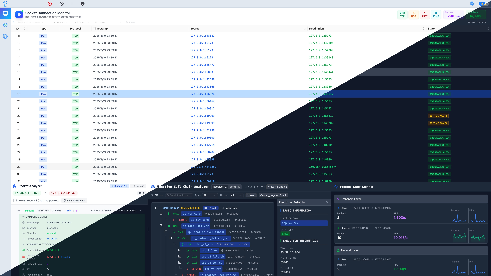

<div align="center">
  
</div>

<p align="center"><a href="./README-zh_CN.md">中文</a> · English</p>

<div align="center">
  
  
</div>

# PacketScope: "Smart Armor" for Server-Side Defense

[](http://82.156.141.213:4173/)

**PacketScope** is a general-purpose protocol stack analysis and debugging tool based on eBPF. It integrates performance optimization, anomaly diagnosis, and security defense. It aims to implement fine-grained tracing and intelligent analysis of network packets at the protocol stack level on the server side. By solving three major pain points—difficult diagnosis of performance bottlenecks, unclear transmission paths, and hard-to-detect low-level attacks—PacketScope provides visualized, intelligent endpoint-side security analysis and defense capabilities.



## Background

With the proliferation of social platforms, online banking, large-scale AI models, logistics, and travel services, open servers have become key execution environments. These must balance performance and security under the condition of being openly accessible. Traditional WAFs and IDS tools have blind spots in protocol stack-level defense, which PacketScope addresses:

> **🚨 Three Core Pain Points:**
>
> 1. Unclear packet paths through the protocol stack make bottlenecks and faults hard to diagnose
> 2. Lack of fine-grained cross-domain transmission data makes routing risks invisible
> 3. Low-level protocol stack attacks are stealthy and difficult to detect with traditional tools

Through protocol tracing, path visualization, and intelligent analysis, PacketScope builds "smart armor" for the server.

## 🚀 Core Capabilities

- 🧠 **Intelligent Engine**: Combines eBPF with LLMs for low-level network behavior observation and intelligent security defense
- 📊 **Multidimensional Analysis**: Real-time tracking of network paths, statistics on latency, packet loss, interaction frequency
- 🌐 **Global Network Visualization**: Maps global paths and latency, presented on a topology graph
- 🔐 **Protocol Stack Defense**: Detects and intercepts low-level abnormal traffic, covering the blind spots of traditional WAF/IDS
- 🖥️ **User-Friendly Interface**: GUI designed for easy use by security engineers and operators

## ⚡ Getting Started

### Prerequisites

Before starting, ensure Docker is installed and running on your system:

- **Docker**: Version 20.10 or higher
- **Docker Compose**: Version 2.0 or higher

To verify your Docker installation:

```bash
docker --version
docker compose version
```

If Docker is not installed, please visit [Docker's official website](https://docs.docker.com/get-docker/) for installation instructions.

### One-Click Deployment

PacketScope provides a convenient deployment script that automatically builds and starts all services using Docker Compose.

#### 1. Clone the Repository

```bash
git clone https://github.com/Internet-Architecture-and-Security/PacketScope.git
cd PacketScope
```

#### 2. Run the Deployment Script

Execute the starter script with root privileges:

```bash
sudo bash starter.sh
```

The script will automatically:
- Check your Docker environment
- Stop any existing services
- Build all service containers in the correct order
- Start all services
- Display service status and access information

#### 3. Access the Application

Once deployment is complete, open your browser and visit:

```
http://localhost:4173/
```

### Service Endpoints

After successful deployment, the following services will be available:

- **Web UI**: `http://localhost:4173`
- **Guarder API**: `http://localhost:8080`
- **Tracer API**: `http://localhost:8000`
- **Analyzer-Monitor API**: `http://localhost:8010`
- **Analyzer-Calculator API**: `http://localhost:8020`

### Managing Services

**View service status:**
```bash
sudo docker compose ps
```

**View service logs:**
```bash
sudo docker compose logs -f
```

**View logs for a specific service:**
```bash
sudo docker compose logs -f <service-name>
```

**Stop all services:**
```bash
sudo docker compose down
```

**Restart services:**
```bash
sudo docker compose restart
```

**Restart a specific service:**
```bash
sudo docker compose restart <service-name>
```

> 💡 **Note**: The starter.sh script handles the entire deployment process automatically. For manual deployment or advanced configuration, please refer to the individual module README files in the `modules/` directory.


## 📁 Project Structure

```
.
├── CODE_OF_CONDUCT.md          # Code of Conduct
├── CONTRIBUTING.md             # Contributing Guidelines
├── docker-compose.yml          # Docker Compose configuration
├── Dockerfile                  # Frontend application Dockerfile
├── eslint.config.js            # ESLint configuration
├── index.html                  # Application entry HTML
├── LICENSE                     # Project license
├── modules/                    # Backend service modules
│   ├── Analyzer/              # Analyzer module
│   │   ├── Monitor/           # Traffic monitoring sub-module
│   │   ├── Calculator/        # Protocol analysis sub-module
│   │   └── README.md          # Analyzer documentation
│   ├── Guarder/               # Security protection module
│   └── Tracer/                # Network tracing module
├── package.json                # Node.js dependencies
├── package-lock.json           # npm lock file
├── pnpm-lock.yaml             # pnpm lock file
├── src/                        # Frontend source code
├── public/                     # Static assets
├── README.md                   # English documentation
├── README-zh_CN.md            # Chinese documentation
├── SECURITY.md                # Security policy
├── starter.sh                 # One-click deployment script
├── tailwind.config.js         # Tailwind CSS configuration
├── TODOList.md                # TODO list
├── tsconfig.app.json          # TypeScript app configuration
├── tsconfig.json              # TypeScript base configuration
├── tsconfig.node.json         # TypeScript Node configuration
├── vite.config.ts             # Vite build configuration
└── vite-README.md             # Vite usage instructions
```

### Core Directories

- **modules/**：Contains all backend service modules, each module is an independent microservice
  - **Analyzer/**：Protocol stack analysis and traffic monitoring service
  - **Guarder/**：Security protection and threat detection service
  - **Tracer/**：Network path tracing and topology analysis service
  
- **src/**：Frontend application source code, built with React and TypeScript

- **public/**：Static asset files such as images and icons

- **starter.sh**：One-click deployment script that automates building and starting all services


## ✨ Functional Modules

PacketScope consists of three main modules, each serving a specific purpose:

```
modules
├── Analyzer  # Python-based protocol stack analysis, traffic monitoring and fine-grained tracing module
├── Guarder   # Go-based security policy module
└── Tracer    # Python-based network path mapping module
```

- **Analyzer**

  Provides multidimensional statistics on packet movement in the protocol stack, including traffic volume, latency, cross-layer interaction frequency, and packet loss. Tracks interactions of connections/packets in the protocol stack and generates a detailed visual path map. Users can click to explore different protocol layers and understand the data flow.

- **Tracer**

  Maps routes and latency from the host to any global IP address, displaying this data on a global topology for optimization insights.

- **Guarder**

  Filters and controls abnormal packets using customizable rules and provides contextual insights powered by LLMs to help interpret and respond to potential threats.

## 🧰 Use Cases

- **Network Protocol Stack Performance Optimization**: Identify bottlenecks and improve transmission efficiency
- **Threat Detection and Security Defense**: Detect and block potential attacks such as DDoS and ARP spoofing
- **Fault Diagnosis**: Diagnose issues caused by latency, packet loss, or abnormal cross-layer behavior
- **Topology Analysis**: Analyze path latency and routing performance in cross-regional deployments
- **Industrial Internet Security**: Monitor industrial control systems in real time to ensure safety and integrity

## ❤️ Contributing

We welcome issues and pull requests! If you find bugs or have suggestions, open an issue or PR. Please refer to [CONTRIBUTING](./CONTRIBUTING.md) for contribution guidelines.

## License

This project is licensed under the MIT License. See [LICENSE](./LICENSE) for details.
