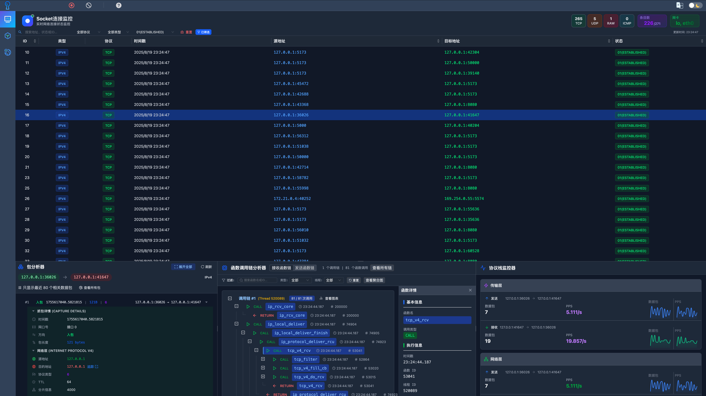

<div align="center">
  
</div>

<p align="center"><a href="./README-zh_CN.md">中文</a> · English</p>

<div align="center">
  
  
</div>

# PacketScope: "Smart Armor" for Server-Side Defense

**PacketScope** is a general-purpose protocol stack analysis and debugging tool based on eBPF. It integrates performance optimization, anomaly diagnosis, and security defense. It aims to implement fine-grained tracing and intelligent analysis of network packets at the protocol stack level on the server side. By solving three major pain points—difficult diagnosis of performance bottlenecks, unclear transmission paths, and hard-to-detect low-level attacks—PacketScope provides visualized, intelligent endpoint-side security analysis and defense capabilities.




## Background

With the proliferation of social platforms, online banking, large-scale AI models, logistics, and travel services, open servers have become key execution environments. These must balance performance and security under the condition of being openly accessible. Traditional WAFs and IDS tools have blind spots in protocol stack-level defense, which PacketScope addresses:

> **🚨 Three Core Pain Points:**
>
> 1. Unclear packet paths through the protocol stack make bottlenecks and faults hard to diagnose
> 2. Lack of fine-grained cross-domain transmission data makes routing risks invisible
> 3. Low-level protocol stack attacks are stealthy and difficult to detect with traditional tools

Through protocol tracing, path visualization, and intelligent analysis, PacketScope builds "smart armor" for the server.

## 🚀 Core Capabilities

- 🧠 **Intelligent Engine**: Combines eBPF with LLMs for low-level network behavior observation and intelligent security defense
- 📊 **Multidimensional Analysis**: Real-time tracking of network paths, statistics on latency, packet loss, interaction frequency
- 🌐 **Global Network Visualization**: Maps global paths and latency, presented on a topology graph
- 🔐 **Protocol Stack Defense**: Detects and intercepts low-level abnormal traffic, covering the blind spots of traditional WAF/IDS
- 🖥️ **User-Friendly Interface**: GUI designed for easy use by security engineers and operators

## ⚡ Getting Started

### Start Server Modules

This project includes multiple server-side modules implemented in different languages. Follow the instructions in each module’s `README.md` to install dependencies and start services.

```bash
modules
├── Analyzer  # Python-based protocol stack analysis module
├── Guarder   # Go-based security policy module
├── Locator   # Python-based network path mapping module
└── Tracer    # Python-based traffic monitoring and fine-grained tracing module
```

### Start Frontend Service

The frontend is built on [Node.js](https://nodejs.org/en). Please ensure Node.js (version ≥ 16) is installed.

#### 1. Install Dependencies

Run the following command in the project root:

```bash
npm install
```

> ⚠️ For users in mainland China, set npm mirror to speed up installation:

```bash
npm config set registry http://registry.npmmirror.com
```

#### 2. Start Preview Server

```bash
npm run preview
```

The application runs locally by default on port `4173`.

#### 3. Access the App

Open your browser and visit:

```
http://localhost:4173/
```

> 💡 To run in development mode with hot reloading, use the following command:

```bash
npm run dev
```

> 💡 To build the project for production, use the following command:

```bash
npm run build
```

## ✨ Functional Modules

- **Tracer**

  Tracks interactions of connections/packets in the protocol stack and generates a detailed visual path map. Users can click to explore different protocol layers and understand the data flow.

- **Analyzer**

  Provides multidimensional statistics on packet movement in the protocol stack, including traffic volume, latency, cross-layer interaction frequency, and packet loss.

- **Locator**

  Maps routes and latency from the host to any global IP address, displaying this data on a global topology for optimization insights.

- **Guarder**

  Filters and controls abnormal packets using customizable rules and provides contextual insights powered by LLMs to help interpret and respond to potential threats.

## 🧰 Use Cases

- **Network Protocol Stack Performance Optimization**: Identify bottlenecks and improve transmission efficiency
- **Threat Detection and Security Defense**: Detect and block potential attacks such as DDoS and ARP spoofing
- **Fault Diagnosis**: Diagnose issues caused by latency, packet loss, or abnormal cross-layer behavior
- **Topology Analysis**: Analyze path latency and routing performance in cross-regional deployments
- **Industrial Internet Security**: Monitor industrial control systems in real time to ensure safety and integrity

## ❤️ Contributing

We welcome issues and pull requests! If you find bugs or have suggestions, open an issue or PR. Please refer to [CONTRIBUTING](./CONTRIBUTING.md) for contribution guidelines.

## License

This project is licensed under the MIT License. See [LICENSE](./LICENSE) for details.
